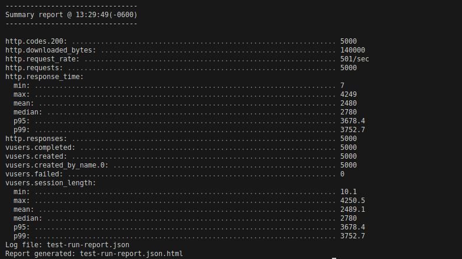

import { localizeTime, formatTime } from "../../../utils.ts";
import { Content as Deadlines } from "../../../components/Deadlines.md";

## {frontmatter.description}

**Due**: {formatTime(localizeTime(frontmatter.due))}

**Quickstart**: To create a new repository under your own GitHub account, you can create a new
**private** repository from [this
template](https://github.com/swad-cs-uic/hw5-Performance). Sharing your code,
intentionally or unintentionally, is a violation of the academic integrity
policy in this course.

# Description

- You are given a basic script, that is inherently slow (In terms of concurrent requests being satisfied) Your task for this assignment is fairly straightforward.
  1.  Given the basic `server.js` update the code to make it more performant.
  2.  Look out for the section in the code which you think, if optimized, will result in a performance boost.
  3.  The motivation for the assignment is to elucidate the tools/tricks that can be brought into play to measure your application performance and thus making it better.

## Tools / Techniques Used in the Assignment

1. Flame graphs: Flame graphs are a CPU profiling visualization technique that helps to spot at glance the most frequently used function, and most importantly the time they need to run.

2. 0x: A tool to generate flame-graphs for node.js

   ```js
   Install by: npm install -g 0x
   ```

3. Artillery: Artillery.io, an open-source, modern, powerful, and flexible load testing toolkit. Artillery is designed to help developers and testers assess the performance and scalability of their systems.

   ```js
   Install by: npm install -g artillery
   ```

4. MongoDB: Open source NoSQL database management program. `Assignment expects you to have a running MongoDB server.`

   - Installation on Linux/Ubuntu: [Check here](https://www.mongodb.com/docs/manual/tutorial/install-mongodb-on-ubuntu/)
   - Rest [Check here](https://www.mongodb.com/docs/manual/administration/install-community/)

### Install the dependencies using npm install

- This will also populate the MongoDB document for you as a postInstall script `load.js`.
- Your `server.js` will then be communicating with the datastore.

## Deliverables

1. Optimize server.js.
2. Generate flame-graph using `npm run flame-graph`
3. Do the perf testing using `npm run load-test`. You need to have a running server for this. Run by `node server.js`
4. Submit the following merged as a `SINGLE PDF`
   - Flame-graph
   - Screenshot for Artillery summary As shown below
     - 
   - Generated test-run-report (HTML)

### Reference Article: [Must Check for better understanding](https://www.alxolr.com/articles/squeeze-node-js-performance-with-flame-graphs)
