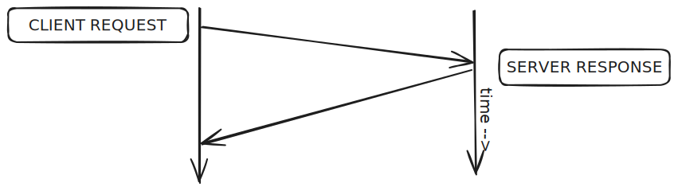
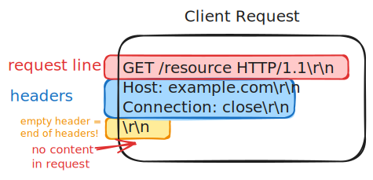
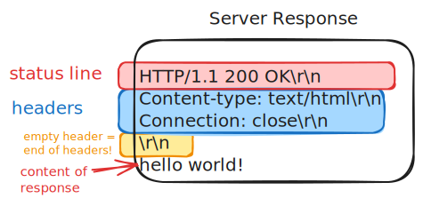

If you're gonna learn about web development, you've got to understand the [Hypertext Transfer Protocol, HTTP](https://www.rfc-editor.org/rfc/rfc9112.html).

# HTTP is a protocol

HTTP is a protocol - an open set of rules for how to send bytes back and forth between two computers to perform some useful work on behalf of the humans that operate those computers. A **protocol** is just a set of rules that a bunch of humans have agreed to follow when they _do_ something. Just like you can only meaningfully play standard chess if you follow the rules of chess, you can only do HTTP if you follow the rules of HTTP - so that the two computers talking to each other understand the meaning behind the bytes being sent back and forth.

## Layering

As a quick aside into a more networking-focused topic, standard HTTP is built on top of the **Internet Protocol** (IP) and the **Transmission Control Protocol** (TCP). Layering gives protocol designers a set of features they can use to build on top of. TCP and IP give us:

- Client-server communication: clients _initiate_ communication with servers, and thus they need to know the IP address of the server they want to connect to. Servers need to be able to accept those connections from anywhere on the Internet if they want to make their service available to the entire world.
- Two-way, reliable, in order, byte stream communication: this sounds really complicated, but it basically means that if the client sends bytes 123456, the server will receive 123456, it won't receive 123654, it won't receive 123 (and nothing else), and it won't receive 456123, and the same goes for the server sending messages to the client. In reality, we don't send individual bytes across the internet, they're actually sent within individual chunks. After these chunks are received, the operating system effectively "glues" together the ordered list of bytes with no border in between.

## Basic semantics of HTTP

Now that we're building on top of TCP/IP, there are a few basic rules that make HTTP unique as a protocol:

The client always communicates first. This makes intuitive sense, because it's the client that wants something, that's why they connected to the server in the first place. The client sends a **request** for a specific **resource**, and then the server sends back a **response** which either contains the requested resource or an error message.

Sometimes you'll see the term "client" and sometimes you'll see the term "user agent". A user agent is a program that sends HTTP requests and receives HTTP responses. A web browser is a user agent, but so is a program like `curl` that sends HTTP requests to a server to download a file. The term "user agent" is used to emphasize that the client is a program that acts on behalf of a human user. In this class, we'll usually just use the term "client," but if someone mentions "user agent" you can think of that s "the program that makes HTTP requests on behalf of a user."

All HTTP communication consists of individual client requests, followed by individual server responses. Multiple request/response pairs can happen within the same TCP connection, but each request-response pair is independent of the others.



At the absolute, most basic level, this is all there is to HTTP: clients sending requests, and servers sending responses. If the client wants to request a different resource, they send another request. One request can't ask for two files, or ask "follow up questions" - want new stuff? make a new request. User agents and web apps sometimes bend the rules to make things faster / easier to program, but at the protocol level, that's it.

To make things easier, both the client and the server send messages that are broken up into three parts: the **request line** (for clients) or **status line** (for servers), **headers**, and **body**. The request/status line ends with the first `\r\n` bytes in the message. Then for **both** requests and responses, sending the headers and body follow the same rules. The headers are a list of `Key: Value` pairs each delimited by `\r\n` again, and the end of the headers is a "blank" header, which can be simplified down to looking for the special string `\r\n\r\n` (aka the end of a header and then another end of header immediately after it). Because `\r\n` renders as a newline in most editors, you may also see people say that a "blank line" is the border between the headers and the body. Depending on what kind of message the request/response is, the body or the headers may be blank.

### Requests and responses

A basic HTTP request looks like this:



The first line of data sent by the client (called the **request line**) indicates which **method** the client is using, which **resource** the client is requesting, and which **protocol version** the client is using to make that request.

### The status line

A basic HTTP response looks like this:



Likewise, the first line of data sent by the server (called the **status line**) indicates which **protocol version** the server is using to respond, which **status code** the server is sending back, and a **reason phrase** that gives a human-readable explanation of the status code.

### Headers

Headers are key-value pairs that provide additional information about the request or response. They can be used to send metadata about the request or response, such as the content type of the body, the length of the body, or the date and time the message was sent. The headers end when a blank line is encountered.

### Request and response bodies

Both requests and responses can, but do not always, have bytes of data after the end of the headers. The body can be any kind of data (the kind is usually included in the `Content-Type` header).

### The end of the message

One fundamental challenge in all network communication, and even in all storage and transmission of bytes is: how do you know where the end is? In HTTP, we've already seen how the status/request line and the headers are separated: we look for blank lines. However the body of a message should be allowed to have blank lines in it! The main way that HTTP messages know where the end is is by looking at the `Content-Length` header. This header tells the client or server how many bytes are in the body of the message. If the `Content-Length` header is missing, the client or server has to use some other method to determine the end of the message. This is why you'll sometimes see a `Transfer-Encoding: chunked` header in HTTP messages - it's a way of sending the body in chunks, with each chunk preceded by a line that tells the client how many bytes are in the chunk. Finally, if you're using the old HTTP/1.0 version (very uncommon) or explicitly send the `Connection: close` header, the client or server can know that the message is over when the underlying connection is closed.

### The most basic web application: a static file server

One somewhat abstract but important point about HTTP is that it's a _protocol_ - it's a set of rules for how a server can deliver a service to clients. It isn't a service itself. This means that you can write a program that follows the rules of HTTP, and that program can do anything you want it to do. The most basic web application is a static file server: a program that listens for HTTP requests, reads the requested file from disk, and sends it back to the client. This is the kind of program that you're interacting with when you visit a static website - the server is just sending you files from disk.

If all we're trying to do is serve files (not add new files or change files), we can write a simple static file server in just a few lines of Python:

```python
import os
import socket

def serve_file(filename):
    try:
        with open(filename, 'rb') as f:
            content = f.read()
        return b"HTTP/1.1 200 OK\r\nConnection: close\r\n\r\n" + content
    except FileNotFoundError:
        return b"HTTP/1.1 404 Not Found\r\nConnection: close\r\n\r\nFile not found."

def handle_request(request):
    lines = request.split(b'\r\n')
    if lines:
        method, path, _ = lines[0].split(b' ')
        if method == b'GET':
            filepath = path.decode('utf-8').lstrip('/')
            return serve_file(filepath)
    return b"HTTP/1.1 400 Bad Request\r\nConnection: close\r\n\r\n"

def start_server(host='0.0.0.0', port=8080):
    with socket.socket(socket.AF_INET, socket.SOCK_STREAM) as s:
        s.bind((host, port))
        s.listen(1)
        print(f"Serving on {host}:{port}")
        while True:
            conn, addr = s.accept()
            with conn:
                request = conn.recv(1024)
                response = handle_request(request)
                conn.sendall(response)

if __name__ == "__main__":
    start_server()
```

You can copy and paste this into a file called `server.py`, and then run `python server.py` to start a simple HTTP server that listens on port 8080 and serves files from the current directory. You can test it by visiting `http://localhost:8080/` in your web browser, or using `curl` to make requests from the command line. For example, `curl http://localhost:8080/server.py` will request the file `server.py` from the server, which should show you the source code of the server itself. You can also ask curl to show you more debugging output including headers being sent and received by using the `-v` flag: `curl -i http://localhost:8080/server.py`. Likewise, you can do the same inspection in your browser by opening the devtools "network" tab and making a request.

:::note
Most examples will assume you're using a Unix-like operating system (like Linux or MacOS), which allows you to use popular unix utilities like `curl`. The best way to accomplish this on a Windows machine is to use the Windows Subsystem for Linux (WSL), which allows you to run a Linux distribution alongside your Windows installation.
:::

#### What's happening in this code?

There's a lot of lower level networking happening here that we won't focus on in CS 484 - for our purposes, it's important to know that you're creating a server that listens forever on a specific port for clients to connect. When a client connects, the server reads the request from the client, sends a response back, and then closes the connection.

An easier way to do the same thing we did here is simply to run `python -m http.server 8080` in the directory you want to serve files from. Python, like many other languages, has a built in static file server that will serve files from the underlying filesystem.

What we've done here is leverage the HTTP protocol to create a web application. This application can then be accessed by any client that also knows how to speak HTTP, whether it's a browser or a command line program, running on a laptop or a phone or a server in the cloud. This is the power of HTTP - it's a protocol that allows any client to interact with any server, as long as they both follow the rules.

# Suggested exercises

- Use cURL to make http requests to your favorite websites
- Use cURL to make http requests to [httpbin.org](http://httpbin.org) to see how different headers and request methods work
- Use your browser's developer tools to inspect the HTTP requests and responses made when you visit a website

# Further reading

- [Brief History of HTTP](https://hpbn.co/brief-history-of-http/): the entirety of "High Performance Browser Networking" is a great introduction to the lower level nuts and bolts of making HTTP fast, with a focus on the network side of things.
