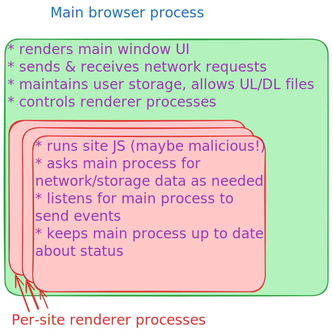

In the last section, we learned about the HTTP protocol, which can be used to request and receive resources from a web server. In this section, we'll learn about the web browser, which is the most common type of device that uses HTTP to request and receive resources from a web server.

# The goal of a web browser

Fundamentally, a web browser does two things. One, it allows you to view and interact with web pages rendered out of a collection of resources - HTML for page architecture, textual content, and markup; CSS for styling; JavaScript for interactivity; images, videos, audio, etc for richer media experiences. Two, it allows you to navigate between different web pages on the Internet via hyperlinks. This is one of the really "magical" parts of the web and why it became so popular - being able to easily both navigate between different sites and organize links to them from anywhere created the first truly global information system.

## Isolation

Because you're using one tool (the browser) to navigate between lots of different websites, and because each website can itself include resources from other websites, one of the most important jobs for the browser is **isolation**. This means that the browser has to make sure that the resources from one website don't interfere with the resources from another website. This is a big part of what makes the browser unique, especially from a security perspective.

Your browser is responsible for performing lots of different isolation tasks:

- **Origin isolation**: making sure that resources from one origin can't access resources from another origin. This is the same-origin policy which we'll go into more detail about later.
- **Process isolation**: making sure that if one tab crashes, it doesn't crash the whole browser, and if one tab is compromised, it doesn't compromise the whole browser.
- **Storage isolation**: making sure that user data from one origin can't be accessed by another origin.

## Architecture

If we start thinking about building a browser as a software engineer, we can see a few different important parts: there's the main **user interface** that renders the browser window, tabs, URL bar, etc, and receives input (clicks, swipes, taps, key presses) from the user; there's the **rendering engine**, which is what takes the HTML, CSS, and JavaScript for a given frame and turns it into a visual representation that the user can see and interact with. There's also the **browser engine**, which coordinates the UI and the rendering engine, and there's the **networking engine**, which actually sends and receives the HTTP requests and responses, and the **storage engine** that keeps track of things like cookies, and provides them to other parts of the browser as needed. Finally, there's the **JavaScript engine**, which is what executes the JavaScript code that's included in the web page.

Modern browsers have a multi-process architecture. There is a main **browser process** that coordinates the overall interface, storage, and network requests, and then there are separate **renderer** processes for each site that you have open - usually this corresponds to individual tabs, but sometimes tabs can each have multiple frames controlled by different sites.

Processes provide strong isolation guarantees: the main process can spawn these individual renderer processes and prevent them from accessing any information besides what the main process chooses to send to them. This process architecture not only does this provide a strong security isolation guarantee, running each site in its own process makes it so that if one tab crashes, it doesn't crash the whole browser, and if one tab is compromised, it doesn't compromise the whole browser.

This is also an example of the principle of least privilege: the browser process only gives the renderer processes the information they need to render the page, and nothing more. This is very important in the web context because part of what makes the web a powerful environment (you can visit any web page and immediately use the cool functionality that the site authors made!) also makes the web a dangerous environment (you can immediately start running hostile code that might try to steal your data or compromise your computer).

# Further reading

- [Inside look at a modern web browser](https://developer.chrome.com/blog/inside-browser-part1): this entire series is a great in-depth look at how Chrome works under the hood.
