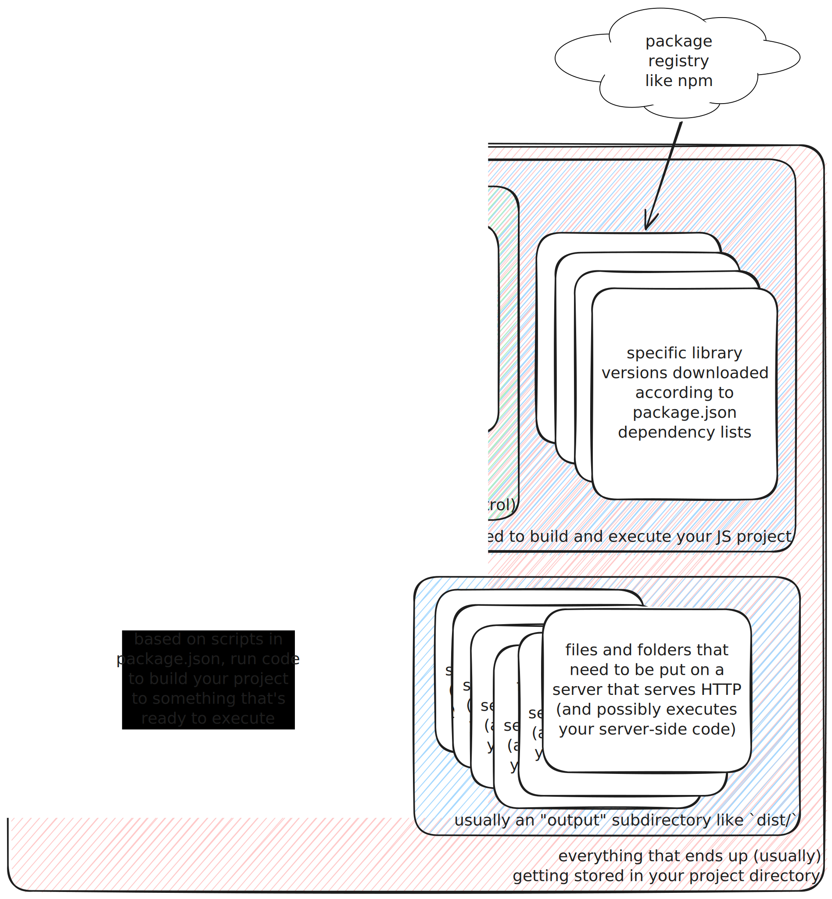

JavaScript is the language of the web. It's the only language that runs in every
web browser, and it's the only language that can interact with the web page
itself. 

JavaScript is a high-level, dynamic, untyped, and interpreted language. Despite
the name, JavaScript has very little in common with Java - it's a completely
different language with a completely different syntax and feature set.

## JavaScript for Computer Science Students

While there are quite a few resources online for learning computer science using
JavaScript, there aren't a whole lot focused specifically on the needs of
computer science students. Here are some of the key concepts that a >=3rd year
computer science student, who already has a good foundation both in computer
science basics and different language paradigms (i.e. CS 341) should know about
JavaScript:

### Syntax Basics
   JavaScript's syntax shares similarities with other C-based languages like C++
   and Java, which might be familiar. Key features include semicolon usage
   (optional in many cases), curly braces for block definitions, and
   case-sensitive identifiers. Understanding these basics is essential to avoid
   common syntax errors.

   **Example:**
   ```javascript
   let x = 5;
   if (x > 0) {
       console.log("Positive number");
   }
   ```

### Dynamic Typing
   JavaScript is dynamically typed, meaning variables don't have a fixed type
   and can hold different types of values during runtime. This flexibility
   allows for more concise code but can also lead to unexpected behavior if
   types are not carefully managed.

   **Example:**
   ```javascript
   let x = 10; // x is a number
   x = "Hello"; // x is now a string
   console.log(x); // Output: "Hello"
   ```

### Functions as First-Class Citizens
   Functions in JavaScript are first-class objects, meaning they can be assigned
   to variables, passed as arguments, and returned from other functions. This
   makes higher-order functions and callbacks a fundamental concept to master.

   **Example:**
   ```javascript
   function greet(name) {
       return "Hello, " + name;
   }
   
   let sayHello = greet;
   console.log(sayHello("World")); // Output: "Hello, World"
   ```

### Definition Hoisting
   JavaScript hoists variable and function declarations to the top of their
   scope during compilation. This means you can _refer_ to a variable or
   function before it's declared in the code, although it's best practice to
   declare variables at the top of the scope to avoid confusion.

   **Example:**
   ```javascript
   console.log(x); // Output: undefined
   var x = 5;
   ```

### Variable scoping

JavaScript's `let` and `const` have block level scope as you're probably used to
from other languages. It also allows declaration as a `var` which has
function-level scoping. Additionally, if declared at the top level, `var` will
be global, while `let` and `const` will not be.

**Example:**
```javascript
function myFunction() {
   console.log(`before declaring, localVar is undefined, ${localVar}.
      if you tried this with a let or const, you'd get a ReferenceError`);
    if (true) {
        var localVar = "I'm function local";
    }
    console.log(`even though it was declared within an internal scope, 
                 ${localVar} is still accessible here`);
}
```

### Closures
   A closure occurs when a function retains access to its lexical scope, even
   when the function is executed outside that scope. Closures are common in
   callback functions and are a powerful feature of JavaScript.

   **Example:**
   ```javascript
   function outerFunction() {
       let outerVar = "I'm from outer";
       return function innerFunction() {
           console.log(outerVar);
       };
   }

   let closure = outerFunction();
   closure(); // Output: "I'm from outer"
   ```

### Prototypes and Inheritance
   JavaScript uses prototype-based inheritance. Objects can inherit properties
   and methods from a prototype, which is another object. Understanding
   prototypes is essential for grasping object-oriented programming in
   JavaScript.

   **Example:**
   ```javascript
   function Person(name) {
       this.name = name;
   }

   Person.prototype.greet = function() {
       console.log("Hello, " + this.name);
   };

   let john = new Person("John");
   john.greet(); // Output: "Hello, John"
   ```

### Asynchronous Programming with Promises
   JavaScript is single-threaded but can handle asynchronous operations like
   network requests without blocking the main thread. Promises represent the
   eventual completion (or failure) of an asynchronous operation and are
   fundamental for managing asynchronous code.

   **Example:**
   ```javascript
   let promise = new Promise((resolve, reject) => {
       setTimeout(() => resolve("Done!"), 1000);
   });

   promise.then((message) => {
       console.log(message); // Output after 1 second: "Done!"
   });
   // You can also use await to wait for a promise to resolve
   async function asyncFunction() {
       let message = await promise;
       console.log(message); // Output after 1 second: "Done!"
   }
   ```

### The Document Object Model (DOM), `window`, and `document`
   The DOM is an interface that allows JavaScript to manipulate HTML and CSS in
   a web page. `window` and `document` are global objects that represent the
   browser window and the web page, respectively. They each have extensive APIs
   that enable interaction with the browser environment and its capabilities.

   **Example:**
   ```javascript
   document.getElementById("myElement").textContent = "New content!";
   ```

### Event-Driven Programming
   JavaScript is heavily event-driven, especially in the context of web
   development. Understanding how to listen for and handle events, such as user
   interactions, is crucial for writing interactive applications.

   **Example:**
   ```javascript
   document.getElementById("myButton").addEventListener("click", function() {
       alert("Button was clicked!");
   });
   window.addEventListener("load", function() {
       console.log("Page loaded!");
   });
   ```

### JSON (JavaScript Object Notation)
   JSON is a lightweight data format used for exchanging data between a server
   and a client. JavaScript's native support for JSON makes it easy to parse and
   generate JSON data, which is a common task in web development.

   **Example:**
   ```javascript
   let jsonString = '{"name":"Alice","age":25}';
   let user = JSON.parse(jsonString);
   console.log(user.name); // Output: "Alice"
   ```

### Strict Mode
   JavaScript's "use strict" directive enforces stricter parsing and error
   handling in your code. Enabling strict mode can help catch common coding
   errors and unsafe actions, leading to more reliable and secure code. Strict
   mode is enabled by default in ES6 modules.

   **Example:**
   ```javascript
   "use strict";
   x = 5; // Error: x is not defined
   ```

## The JavaScript Ecosystem

The previous section focuses on the fundamentals of JS itself, however, the
broader JavaScript ecosystem that supports web development has a lot of other
bits and pieces that are important to understand when getting started in web
development. We'll go into more detail about these in a later module, but for
now these are the basics that you'll need to understand to get started.

### JavaScript runtimes

Every browser incorporates a JavaScript engine that interprets and executes
JavaScript code - v8 (Google's), SpiderMonkey (Mozilla's), and  JavaScriptCore
(Apple's) are some of the most popular ones you'll hear about. These engines
aren't just useful for browsers - they're also used in stand alone JavaScript
runtimes like [Node.js](https://nodejs.org/en), which allows you to run
JavaScript code outside of a browser. Node has been around for quite some time,
and new tools like [Deno](https://deno.com/) and [Bun](https://bun.sh) aim to be
easier to use and faster than Node. We use Node in this class, but most things
can also be accomplished via Deno or Bun if you're interested in learning them.

When it comes to web development, these JS runtimes are typically used for two
different tasks: running your application code (either in production or on your
local machine during development) and running build tools. Each of them will
have "runtime specific" ways to do low level things like reading files, but when
you aren't doing those things, the code you write will be the same across all of
them.

### Package Managers

Whether you're building a client-side or server-side project using JavaScript,
you'll often rely on external packages to provide the functionality of your app.
To use any of these dependencies, you'll need a package manager to download and
install them.

Node Package Manager (npm) is the oldest and most popular, but likewise there
are alternatives like [pnpm](https://pnpm.io/) and bun's built in package
manager. Here I'll explain npm's functionality, but the concepts are the same
for all of them.

Node packages are defined by a `package.json` file that lists the dependencies
and metadata about any individual JavaScript project. This can be a library or a
full application. The `npm` command can be used to create new projects, install
dependencies, and run scripts defined in the `package.json` file. An individual JS project folder ends up looking like this:




Each library can have its own dependencies, which can have their own
dependencies, and all of these are required to build and/or run your project. As
you can imagine, for a complicated project, this can get large very quickly.
That's one of the many reasons not to commit `node_modules` to your source
control. It's also the reason that this meme is funny:


Unlike other environments like Python, generally it's very uncommon for someone
to write an individual `.js` file and just run it using the `node` command.
Instead, you'll be generating a `package.json` file and using `npm` to run your
dev server, run your tests, or build your project for production.


### Module Systems

JavaScript uses module systems like CommonJS and ES Modules to organize code
into reusable and maintainable units. These operate differently, are used
differently, but all attempt to solve the same problem: splitting code into
manageable pieces. ES Modules, with its `import` and `export` syntax, is the
standard we'll be using in this class, and we'll go over some of the differences
later.

### Bundlers and Transpilers

Most JavaScript projects don't run the code you write directly in the browser or
even on the server side. They might need to add new features that aren't
supported by the browser, or take a special language like TypeScript and
translate it into vanilla JavaScript that can be run by Node or the browser.
These tools can also optimize your code in various ways so that it's ready to
run in production as fast as possible.

# Further Reading

[The Modern JavaScript Tutorial - good primer on JS the language](https://javascript.info/)

[MDN - the reference for all things web](https://developer.mozilla.org/en-US/) (this also includes some good primers on JS if you are very new to JavaScript and want to learn more)

[The WHY behind the WAT](https://medium.com/dailyjs/the-why-behind-the-wat-an-explanation-of-javascripts-weird-type-system-83b92879a8db) - explaining one of the most infamous JavaScript talks, [wat](https://www.destroyallsoftware.com/talks/wat).
