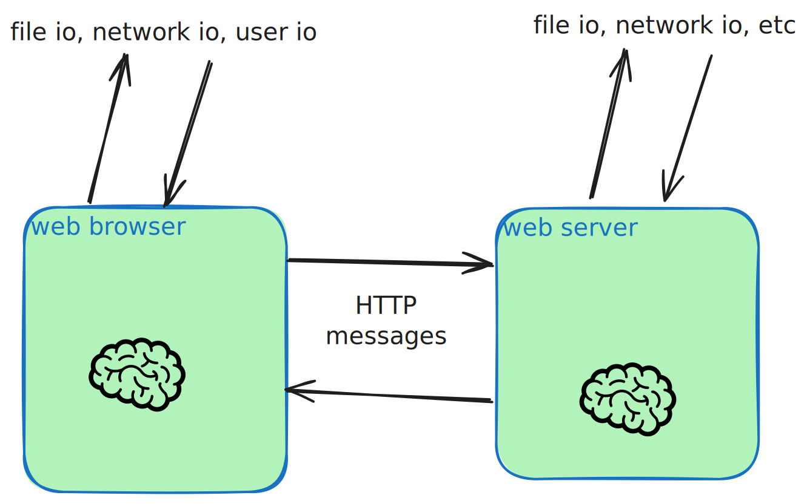

Many people use the web, or the technologies enabled by it, every single day. In this chapter we'll build an understanding of the basics of the web _as a service delivery platform_, so that we can start to understand what makes web programming difficult, risky, but ultimately rewarding for those who master it.

## Pedantic version

The web is a system for communication between web clients and web servers using the HTTP and HTTPS protocols. This doesn't tell us much, but it is technically correct.

## More historical, more nuanced version

In the popular consciousness, "the Internet" and "the Web" were basically synonymous between the rise of the web and the rise of smartphone apps. Besides email, "the web" has been the main way for people to experience "the Internet" since the late 90's. Even email is very often accessed through a web interface, so to many, the terms are still synonymous.

The crazy thing is that technically, "the Internet" really is almost entirely "the web" from the perspective of your machine - with the noted exception of email, nearly every service that's become popular on the Internet in the last 30 years is built on top of the HTTP protocol. In many situations, it's even built on top of the web stack, with HTML/JavaScript/CSS to render the client side part of the service.

So if someone comes up to me and says, "you're a computer scientist aren't you? What is _the web_ anyway? I heard somebody in congress called it a series of tubes," first that's a great reference. Second, I would probably say something along the lines of, "the web was the first Internet technology that really took off with the public - it's a combination of an **effective protocol** that allows for sufficient flexibility to perform a lot of different useful services, along with the magic of _hyperlinks_ that allowed lots of different people to run lots of different services doing lots of different things in different places, but all easily accessible and link-able in a way that made information infinitely easier to access than any previous technology."

## What you need to know for this course version

The web is fundamentally a _distributed system_ - it consists of multiple independent computers each following a set of rules to perform some worthwhile service for the humans interacting with it. The web is structured such that in every individual unit of communication, there are two computers: one _client_ and one _server_. As we'll learn later on, lots of other computers usually participate in serving individual requests, especially for big Internet properties like Google or Amazon.

# Web platform: the basics

The code running on the server is usually the first thing we think about when we think about being a **web developer**. As we start our journey into being web developers, that is true: that's where we usually start running code that actually does interesting things instead of, for instance, just serving static files. Writing code for the server side is typically referred to as _back end_ web development. One of the many powerful properties of the web platform is that, because of the open and standardized HTTP protocol for communication, any software written in any language for any computer can act as a web server. All it needs to be able to do is send and receive messages over the Internet. Thus, any Internet connected computer that can receive incoming connections can participate in the Internet as a web server.

The code running on the client side is usually a web browser running on a user's computer. This is typically referred to as _front end_ web development, and is slightly more restricted in its programming due to the necessity of a web browser. Web browser functionality is also an open specification, which is why you see lots of different web browsers written in different languages and available on different platforms. While browser development is definitely related to web development, it usually isn't considered as such. Web development is typically writing the software which will run **inside** the browser. The applications in the browser are running a combination of HTML, CSS, and JavaScript to deliver their functionality to the user, which we'll see more in a later chapter.

## Exceptions to the rule

While most user-facing client-side web programming is targeted at the browser, not all of it is. A web client can also be a web scraping script, a mobile application, or even a web server making a request to a different web server. Sometimes these clients execute (or simulate) the entire web browser platform's functionality, and sometimes they simply send raw http requests and return the resulting bytes of the response to the client: `curl` and `wget` are the most common ways to make raw requests from the command line in this fashion.

# The Web as a Distributed System

The traditional programming model that you learn in Computer Science courses
assumes one CPU, one memory, and one collection of inputs and outputs (those
could be from user input, or bytes saved to disk, or network connections, etc).
The web is fundamentally different from this model because it is a _distributed
system_: there are multiple independent computers, each with their own CPU,
memory, and inputs and outputs. These computers communicate with each other over
a network (the Internet) using a well defined protocol (HTTP/HTTPS).

The fact that there is more than one "brain" (CPU) involved makes things tricky.
For the purposes of this class, we can think about a web application like this:

The first aspect of this that's interesting, important, and challenging is that
being in charge of keeping two brains in sync is hard. The client and server
each have their own memory, and they each have their own inputs and outputs. The
only way that they can communicate is by sending messages to each other over the
network. Messages over the network can take a long time to arrive or even get
dropped. So if you want to keep some state (data) in sync between
the client and server, you have to explicitly send messages back and forth to do
so. This is a lot harder than just keeping everything in one place.

## The distributed nature of web programming makes SECURITY interesting

One of the first and most important aspects of security in the web development
context is that in most cases, the client side computer and the web browser that
they're using are owned, managed, and operated by the end user. As mentioned
above, this is hard enough to get right. However, this is **also** one of the
first things that makes web programming _dangerous_ from a security perspective:
you as a web developer are writing code that is instantly deployed to and
executed on a client's computer ([relevant XKCD](https://xkcd.com/1367/)), and
nearly all of those clients will be normal browsers faithfully following the
instructions that your server sent to it. But every once in a while that client
will be an attacker attempting to extract private data, a scraping bot
attempting to download your entire website for inclusion in their awesome new
LLM, or even an end user with an aggressive ad blocker manipulating the way that
their browser does (or doesn't) make certain requests.
